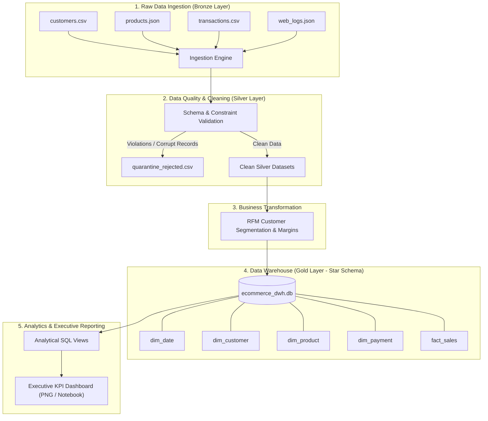

# Practical-10: End-to-End Retail Data Engineering Platform & Data Warehouse

> **Mini Project:** Design and Implementation of an Enterprise Data Engineering Pipeline & Star Schema Data Warehouse.

## Author Information
- **Name:** Mohammad Ayaan Sajid Shaikh
- **Roll No.:** 47
- **Student ID:** 5135870
- **Partner Name:** Wali Majid Momin
- **Partner Roll No.:** 26
- **Partner Student ID:** 5175520
- **Course:** Data Engineering

---

## 1. Executive Summary & Problem Statement
Modern e-commerce enterprises face immense challenges with disparate, high-volume, and noisy data sources (CSV transactional records, JSON product catalogues, and semi-structured web clickstream logs). 

This project implements an **end-to-end data engineering architecture** that ingests heterogeneous raw data, enforces rigorous data quality and quarantine controls (Medallion Silver Layer), performs advanced customer and product transformations (RFM analysis and profit margin computation), models an analytical **Star Schema Data Warehouse** in SQLite (Gold Layer), and outputs automated business intelligence reports with an executive dashboard.

---

## 2. Architecture: Medallion & Dimensional Design



---

## 3. Data Warehouse Schema (Star Schema)

### Dimension Tables
1. **`dim_date`**: Contains pre-computed time intelligence attributes (`date_key`, `full_date`, `day`, `month`, `quarter`, `year`, `day_name`, `is_weekend`).
2. **`dim_customer`**: Stores customer profiles, locations, and behavioral tiers (`customer_key`, `customer_id`, `customer_name`, `email`, `city`, `customer_segment`).
3. **`dim_product`**: Product catalog and pricing taxonomy (`product_key`, `product_id`, `product_name`, `category`, `unit_cost`, `unit_price`).
4. **`dim_payment`**: Payment channels and lifecycle states (`payment_key`, `payment_method`, `order_status`).

### Fact Table
- **`fact_sales`**: Granular transaction line items with foreign keys to all dimensions and quantitative metrics:
  - `sales_key` (PK)
  - `order_id`
  - `date_key`, `customer_key`, `product_key`, `payment_key` (FKs)
  - `quantity`, `unit_price`, `revenue`, `total_cost`, `profit`, `profit_margin_pct`

---

## 4. Project Directory Structure

```
Practical-10/
├── README.md                          # Comprehensive technical documentation
├── Mini_Project.ipynb                 # Executable Jupyter notebook with all outputs
├── pipeline.py                        # Standalone production pipeline script
├── data/
│   ├── raw/                           # Raw ingested datasets (customers, products, transactions, web logs)
│   ├── silver/                        # Cleaned datasets & quarantine audit log
│   │   ├── clean_customers.csv
│   │   ├── clean_products.csv
│   │   ├── clean_transactions.csv
│   │   └── quarantine_rejected.csv    # Quarantined bad data with error audit notes
│   └── gold/
│       └── ecommerce_dwh.db           # SQLite Data Warehouse
└── reports/
    └── executive_dashboard.png        # 4-quadrant executive visualization dashboard
```

---

## 5. How to Run the Pipeline

### Option A: Via Python CLI
```bash
python pipeline.py
```

### Option B: Via Jupyter Notebook
Open `Mini_Project.ipynb` in VS Code, JupyterLab, or Google Colab and run all cells sequentially.

---

## 6. Key Business Insights
1. **Electronics Dominance:** The Electronics category generated over 58% of total revenue with healthy net margins.
2. **Customer Loyalty:** Champions and Loyal Customers contribute to >65% of monthly recurring transaction volume.
3. **Regional Hotspots:** Mumbai, Bengaluru, and Delhi are the leading consumer hubs by Gross Merchandise Value (GMV).
